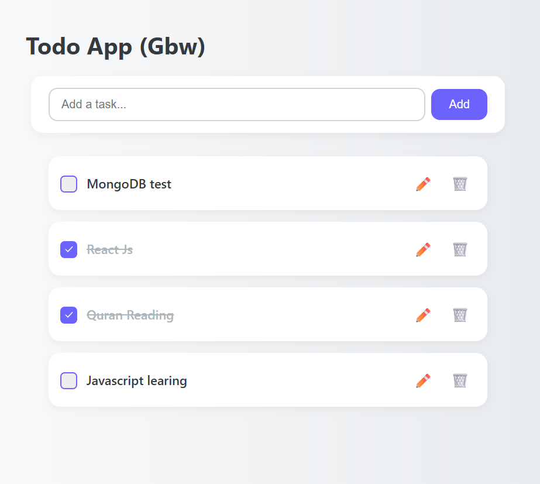

# 📝 Fullstack Todo App with React, Node, and MongoDB

[](LICENSE)
[](https://icabduqaadir12.github.io/Todo-app-with-backend/)
[](https://github.com/icabduqaadir12)

A fullstack Todo App built with **React** (frontend), **Node.js + Express** (backend), and **MongoDB Atlas** (database). Users can add, edit, delete, and toggle todos with real-time updates.

---

## 📸 Screenshots

_You can add screenshots here using Markdown:_



---

## 🚀 Features

- ✅ Add new todos
- 📝 Edit existing todos
- 🔁 Toggle complete/incomplete
- 🗑️ Delete todos
- ☁️ MongoDB Atlas cloud storage
- 🔗 RESTful API for full CRUD

---

## 🧰 Tech Stack

### Frontend
- React (with Vite)
- CSS Modules
- React Hooks

### Backend
- Node.js
- Express.js
- Mongoose
- MongoDB Atlas

---

## 🌐 Live Demo

🔗 **GitHub Pages (frontend only)**  
https://icabduqaadir12.github.io/Todo-app-with-backend/

---

## 📁 Project Structure

Todo-app-with-backend/
├── client/           # React frontend  
│   ├── src/  
│   └── public/  
├── server/           # Node backend  
│   ├── models/  
│   ├── routes/  
│   └── index.js  
└── README.md  

---

## 📡 API Endpoints

| Method | Endpoint         | Description          |
|--------|------------------|----------------------|
| GET    | /api/todos       | Get all todos        |
| POST   | /api/todos       | Create new todo      |
| PUT    | /api/todos/:id   | Update existing todo |
| DELETE | /api/todos/:id   | Delete todo          |

---

## 🛠️ Getting Started

### 1. Clone the Repository

git clone https://github.com/icabduqaadir12/Todo-app-with-backend.git  
cd Todo-app-with-backend

### 2. Setup Backend

cd server  
npm install  
touch .env  

Add your MongoDB URI to `.env`:

MONGODB_URI=your_mongodb_connection_string  
PORT=5000  

Start the backend:

npm run dev

### 3. Setup Frontend

cd ../client  
npm install  
npm run dev

---

## 🔄 Deploy Frontend to GitHub Pages

### 1. Install gh-pages

cd client  
npm install gh-pages --save-dev

### 2. Update package.json

"homepage": "https://icabduqaadir12.github.io/Todo-app-with-backend",  
"scripts": {  
  "predeploy": "npm run build",  
  "deploy": "gh-pages -d dist"  
}

### 3. Build and Deploy

npm run build  
npm run deploy

---

## 🛡️ Future Improvements

- 🔐 Add user authentication (JWT)
- 📅 Add due dates and reminders
- 🔍 Filter and search todos
- 📱 Fully responsive design
- ☁️ Deploy backend to Fly.io or Render

---

## 👤 Author

**Abdukadir Ibrahim**  
GitHub: https://github.com/icabduqaadir12

---

## 📄 License

This project is licensed under the MIT License.

A fullstack Todo App built with **React** (frontend), **Node.js + Express** (backend), and **MongoDB Atlas** (database). Users can add, edit, delete, and toggle todos with real-time updates.

---

## 🚀 Features

- ✅ Add new todos
- 📝 Edit existing todos
- 🔁 Toggle complete/incomplete
- 🗑️ Delete todos
- ☁️ MongoDB Atlas cloud storage
- 🔗 RESTful API for full CRUD

---

## 🧰 Tech Stack

### Frontend
- React (with Vite)
- CSS Modules
- React Hooks

### Backend
- Node.js
- Express.js
- Mongoose
- MongoDB Atlas

---

## 🌐 Live Demo

🔗 **GitHub Pages (frontend only)**  
https://icabduqaadir12.github.io/Todo-app-with-backend/

---

## 📁 Project Structure

Todo-app-with-backend/
├── client/           # React frontend  
│   ├── src/  
│   └── public/  
├── server/           # Node backend  
│   ├── models/  
│   ├── routes/  
│   └── index.js  
└── README.md  

---

## 📡 API Endpoints

| Method | Endpoint         | Description          |
|--------|------------------|----------------------|
| GET    | /api/todos       | Get all todos        |
| POST   | /api/todos       | Create new todo      |
| PUT    | /api/todos/:id   | Update existing todo |
| DELETE | /api/todos/:id   | Delete todo          |

---

## 🛠️ Getting Started

### 1. Clone the Repository

git clone https://github.com/icabduqaadir12/Todo-app-with-backend.git  
cd Todo-app-with-backend

### 2. Setup Backend

cd server  
npm install  
touch .env  

Add your MongoDB URI to `.env`:

MONGODB_URI=your_mongodb_connection_string  
PORT=5000  

Start the backend:

npm run dev

### 3. Setup Frontend

cd ../client  
npm install  
npm run dev

---

## 🔄 Deploy Frontend to GitHub Pages

### 1. Install gh-pages

cd client  
npm install gh-pages --save-dev

### 2. Update package.json

"homepage": "https://icabduqaadir12.github.io/Todo-app-with-backend",  
"scripts": {  
  "predeploy": "npm run build",  
  "deploy": "gh-pages -d dist"  
}

### 3. Build and Deploy

npm run build  
npm run deploy

---

## 📸 Screenshots

_You can add screenshots here using Markdown:_


---

## 🛡️ Future Improvements

- 🔐 Add user authentication (JWT)
- 📅 Add due dates and reminders
- 🔍 Filter and search todos
- 📱 Fully responsive design
- ☁️ Deploy backend to Fly.io or Render

---

## 👤 Author

**Abdukadir Ibrahim**  
GitHub: https://github.com/icabduqaadir12

---

## 📄 License

This project is licensed under the MIT License.
```
